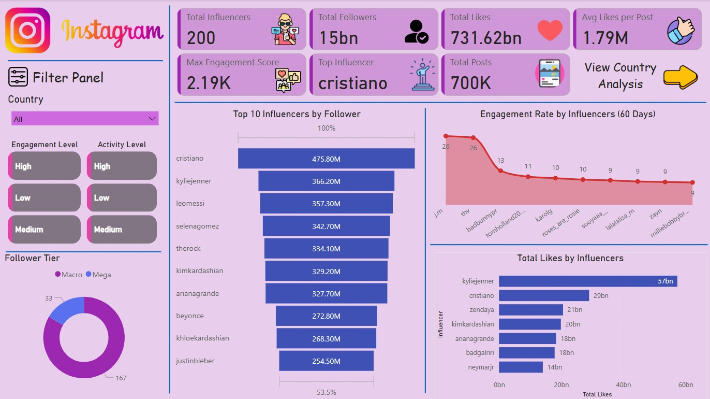
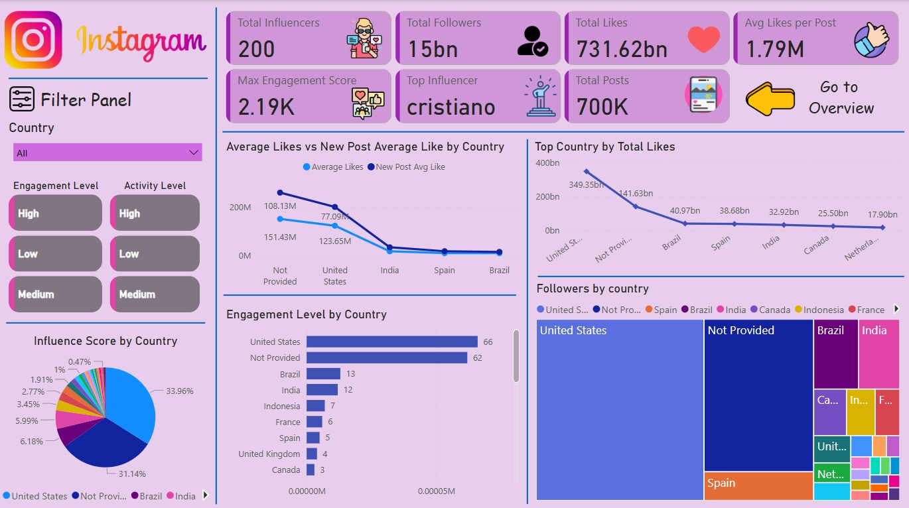

## 📌 Project Overview

This project provides an in-depth analysis of top Instagram influencers using interactive Power BI dashboards. The goal is to uncover meaningful insights on followers, engagement rates, and regional influence using data visualization.

---

## 🧠 What’s Inside?

- ✔️ Cleaned & Preprocessed Instagram data
- ✔️ Created new insightful columns
- ✔️ Calculated custom DAX measures for KPIs
- ✔️ Designed 2 professional dashboards:
  - **Overview Dashboard**
  - **Country-wise Dashboard**
- ✔️ Added navigation buttons and icons for interactivity

---

## 🛠️ Tools & Technologies

| Tool       | Usage                           |
|------------|----------------------------------|
| **Power BI** | Data Visualization & Dashboard |
| **Python (Pandas)** | Data Preprocessing          |
| **Excel**   | Initial data exploration         |
| **Git/GitHub** | Version Control                |

---

## 📊 Dashboards

### 🔹 Overview Dashboard


### 🔹 Country-wise Dashboard


---

## 📁 Project Structure

```
Instagram-Influencers-Analysis/
│
├── Cleaning_Data.ipynb                 # Data preprocessing (Python)
├── Dashboard_1.png                     # Overview Dashboard
├── Dashboard_2.png                     # Country Analysis Dashboard
├── final_cleaned_instagram_data.xlsx  # Cleaned dataset
├── top_insta_influencers_data.xlsx    # Raw input dataset
├── Icons/                              # Custom icons used in dashboard
├── Instagram-Influencers-Analysis.pbix# Power BI project file
```

---

## 🚀 How to Use

1. Clone the repo:
```bash
git clone https://github.com/Riteshhh04/Instagram-Influencers-Analysis.git
```
2. Open `Instagram-Influencers-Analysis.pbix` in Power BI.
3. Explore interactive filters, charts, and insights.

---

## 🙌 Acknowledgments

Icons used from [flaticon.com](https://www.flaticon.com/)  
Data sourced from public Instagram data for educational use.

---

## 📬 Connect

Made with 💜 by [Ritesh](https://github.com/Riteshhh04)
